<div align="center">

  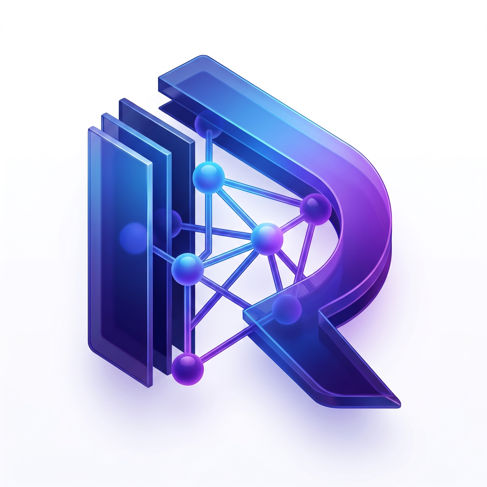

# 🛡️ RepoMind AI

### Autonomous Multi-Agent Repository Intelligence & 3D Galaxy Architectural Platform

**Designed & Engineered for the ChatGPT Codex India Hackathon 2026**

  <p align="center">
    <a href="https://repomind-ai-ten.vercel.app"></a>
    <a href="https://repomind-ai-tktf.onrender.com/docs"></a>
    <a href="https://github.com/himanshu-jadhav108/RepoMind-AI"></a>
    <a href="https://github.com/himanshu-jadhav108/RepoMind-AI"></a>
    <a href="LICENSE"></a>
  </p>

  <p align="center">
    <a href="#-key-project-links"><b>🌐 Live Links</b></a> •
    <a href="#-key-feature-matrix"><b>🚀 Features</b></a> •
    <a href="#-system-architecture"><b>📐 Architecture</b></a> •
    <a href="#-specialized-ai-agent-roster"><b>🤖 10 AI Agents</b></a> •
    <a href="#-api-endpoint-documentation"><b>⚡ API Docs</b></a> •
    <a href="#-quick-start--local-development"><b>🛠️ Quick Start</b></a>
  </p>

_Transform any GitHub repository into an interactive, 3D-visualized, fully audited engineering workspace — powered by 10 autonomous AI agents orchestrated via LangGraph._

</div>

---

## 📸 Platform Demonstration

<div align="center">
  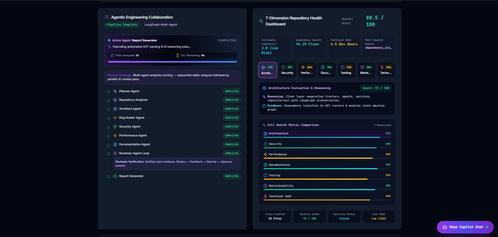
  <p><i>Figure 1: RepoMind AI Live Workspace — 3D WebGL Galaxy Graph, Multi-Agent Execution, and Interactive Audit Center.</i></p>
</div>

---

## 🌐 Key Project Links

| Artifact                        | Access Link / Status                                                                     | Description                                              |
| :------------------------------ | :--------------------------------------------------------------------------------------- | :------------------------------------------------------- |
| 🌐 **Live Website**             | [https://repomind-ai-ten.vercel.app](https://repomind-ai-ten.vercel.app)                 | Production Web Client hosted on Vercel Edge Network      |
| ⚡ **Backend REST API**         | [https://repomind-ai-tktf.onrender.com](https://repomind-ai-tktf.onrender.com)           | FastAPI Microservices Backend hosted on Render Cloud     |
| 📜 **Interactive Swagger Docs** | [https://repomind-ai-tktf.onrender.com/docs](https://repomind-ai-tktf.onrender.com/docs) | OpenAPI 3.0 Interactive API Explorer                     |
| 🎥 **Demo Video**               | [Watch Demo Video (YouTube / Loom)](#) _(Link Placeholder)_                              | Full walkthrough of multi-agent state machine & 3D graph |
| 📊 **Presentation Deck**        | [View Pitch Deck (Canva / PDF)](#) _(Link Placeholder)_                                  | Official ChatGPT Codex India Hackathon 2026 Slide Deck   |
| 📐 **System Architecture Spec** | [View Technical Architecture Doc](docs/)                                                 | Exhaustive Domain Layer & State Graph Specification      |

---

## 📈 Visual Project Metrics

<div align="center">

|         Metric          |                     Benchmark                     | Description                                                           |
| :---------------------: | :-----------------------------------------------: | :-------------------------------------------------------------------- |
|   🤖 **10 AI Agents**   |            **LangGraph State Machine**            | Orchestrated execution loop with automated quality gate review        |
|  🌌 **5 Graph Views**   |   **2D Tree, 3D WebGL, Physics, Orbit, Layers**   | Multi-perspective architectural topology visualization                |
|  🧪 **38 / 38 Tests**   |             **100% Pytest Pass Rate**             | Exhaustive unit, integration, and AST parsing test suite              |
|  ⚡ **5 AI Providers**  | **Gemini, Groq, OpenAI, OpenRouter, HuggingFace** | Adaptive provider router with automatic failover & offline resilience |
|  🛡️ **Explainability**  |           **Line-by-Line & Analogies**            | Every finding backed by AST evidence, confidence scores & analogies   |
| 📥 **3 Export Formats** |         **HTML, Markdown, Executive PDF**         | One-click production audit artifact downloads                         |

</div>

---

## ⚔️ Why RepoMind AI?

| Feature / Metric                    |   Traditional Manual Onboarding    |            RepoMind AI Autonomous Platform             |
| :---------------------------------- | :--------------------------------: | :----------------------------------------------------: |
| **Initial Codebase Comprehension**  |   3 to 5 Days of manual reading    |        **< 30 Seconds** automated AST scanning         |
| **Architectural Boundary Mapping**  | Static diagrams that get outdated  |     **Dynamic 3D WebGL Galaxy Graph** in real-time     |
| **Security & Vulnerability Triage** |      Disjointed CLI scanners       |      **Integrated Security & Bug Hunter Agents**       |
| **Code Explanation & Mentorship**   |   Interrupting senior engineers    | **Interactive Learning Agent** line-by-line breakdowns |
| **Quality Audit & Verification**    |        Manual Code Reviews         |      **LangGraph Self-Correction Reviewer Loop**       |
| **Audit Artifact Generation**       | Manual Confluence/Notion write-ups |       **One-click Formatted HTML & PDF Export**        |

---

## 🌟 Executive Overview

**RepoMind AI** is an enterprise-grade autonomous software engineering intelligence platform engineered for the **ChatGPT Codex India Hackathon 2026**.

When a developer or reviewer submits any GitHub repository URL, RepoMind AI deploys a team of **10 specialized AI agents** orchestrated via a **LangGraph StateGraph**. The platform clones the repo, extracts AST code symbols across 15+ programming languages using a multi-language regex & parser engine, constructs a **NetworkX dependency graph**, executes parallel security, architecture, performance, and documentation audits, and renders a live, interactive **2D ER / 3D WebGL Galaxy Engineering Workspace**.

---

## 🚀 Key Feature Matrix

### 🌌 1. 3D WebGL Galaxy & 2D ER Topology Graph

- **3D WebGL Galaxy Matrix**: Powered by `@react-three/fiber` & `@react-three/drei`. Features custom sphere geometries, dynamic camera distance font scaling (text scales UP when zoomed out for clarity, and DOWN when zoomed in for precision), orbit controls, starfield backgrounds, and 60fps lerp panning.
- **2D ER & Physics Trees**: Built on `ReactFlow` with Dagre tree layouts, force-directed physics, and radial orbit views.

### 🌿 2. 5-Level Hierarchical Drill-Down

- **Level 1**: Root Repositories & Entry Points.
- **Level 2**: Module Folders & Packages.
- **Level 3**: Source Code Files (`.py`, `.tsx`, `.go`, `.rs`, `.java`).
- **Level 4**: AST Class Definitions & Method Functions.
- **Level 5**: AI Agent Reasoning Overlay & Inspection Cards.

### 🎛️ 3. 5 Curated Graph Layout Engines

1. 🌲 **2D Tree View (ER)**: Structured hierarchical parent-child breakdown.
2. 🌌 **3D Galaxy View (WebGL)**: Orbital galaxy matrix with 3D node coordinates.
3. ⚡ **Force Physics**: Dynamic repulsion/attraction spring simulation.
4. ⭕ **Circular Orbit**: Radial centrality ring visualization.
5. 🏗️ **Architecture Swimlanes**: Color-coded Clean Architecture layer grouping.

### 🤖 4. 10 Autonomous AI Agents

- State-machine orchestrated multi-agent workflow powered by **LangGraph**. Delegates work to specialized agents for planning, static analysis, architectural validation, security scanning, performance profiling, docstring verification, code explanation, and automated reviewer sign-off.

### ⚡ 5. Adaptive AI Provider Failover Router

- Intelligent LLM router supporting **Gemini, Groq, OpenAI, OpenRouter, and HuggingFace**. Automatically tests provider latency/quotas and fails over seamlessly to backup keys or deterministic offline mock generators.

### 🛡️ 6. Mandatory Explainability & Evidence

- Zero "black box" claims. Every single audit finding includes:
  - `reasoning`: Structural domain rationale.
  - `confidence`: Calibrated score (0.0 to 1.0).
  - `evidence`: Exact AST source line snippets.
  - `referenced_files`: Full module impact path.

### 📥 7. Executive Export Suite (HTML, Markdown, PDF)

- One-click client-side report generator. Exports beautifully structured executive audit artifacts featuring key metric summary cards, zebra-striped findings tables, and embedded **RepoMind AI logo** branding without server calls.

### 💻 8. Dynamic In-Place Code Viewer & Learning Agent

- Integrated source code viewer featuring syntax highlighting, line jump targeting, and an interactive **Learning Agent** that provides plain-language code analogies and line-by-line breakdowns.

---

## 🖼️ UI Feature Showcase

<div align="center">
  <table>
    <tr>
      <td width="50%">
        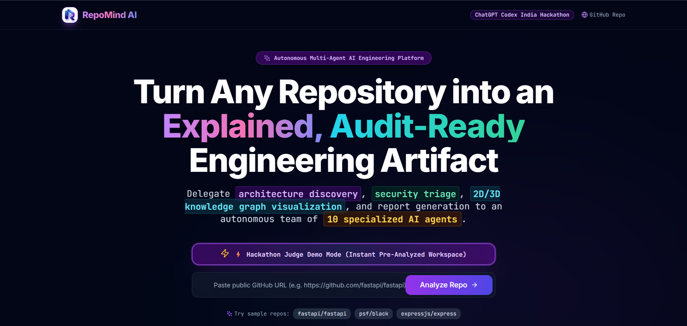
        <p align="center"><b>1. Modern SaaS Landing Page</b></p>
      </td>
      <td width="50%">
        
        <p align="center"><b>2. Autonomous Multi-Agent Workspace</b></p>
      </td>
    </tr>
    <tr>
      <td width="50%">
        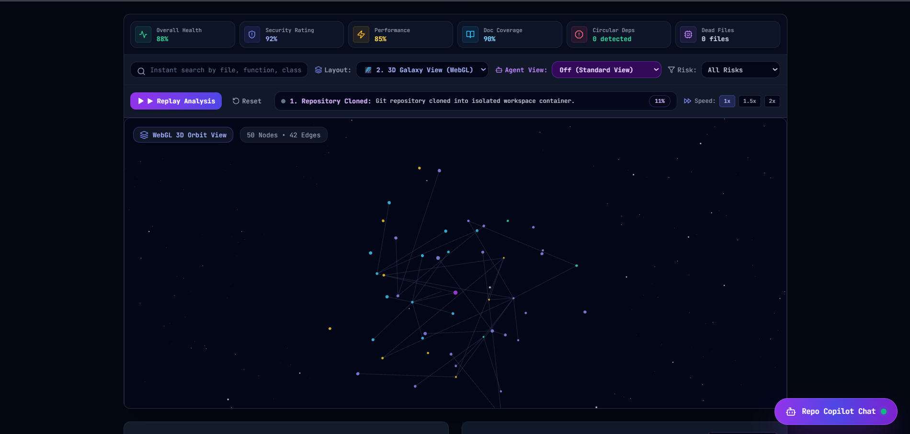
        <p align="center"><b>3. 3D WebGL Galaxy Graph Matrix</b></p>
      </td>
      <td width="50%">
        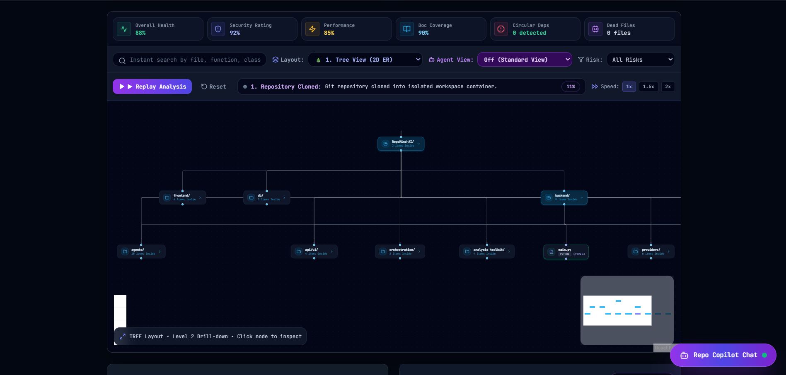
        <p align="center"><b>4. 2D Hierarchical ER Tree View</b></p>
      </td>
    </tr>
    <tr>
      <td width="50%">
        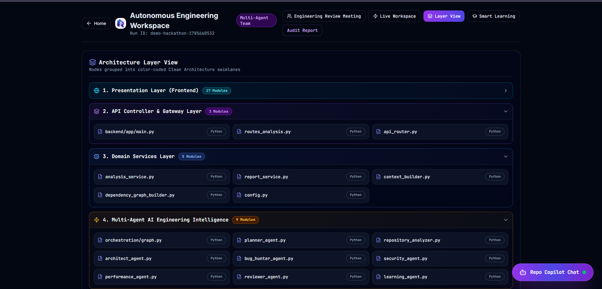
        <p align="center"><b>5. Clean Architecture Swimlanes</b></p>
      </td>
      <td width="50%">
        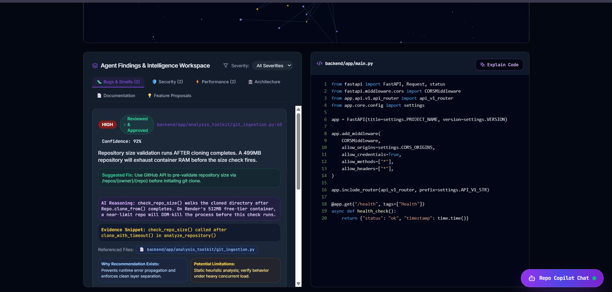
        <p align="center"><b>6. Multi-Agent Findings & Severity Triage</b></p>
      </td>
    </tr>
    <tr>
      <td width="50%">
        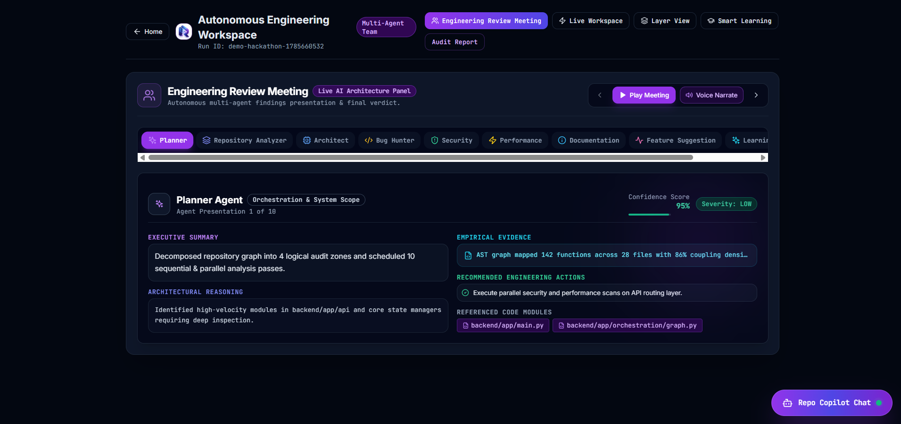
        <p align="center"><b>7. Interactive Engineering Review Meeting</b></p>
      </td>
      <td width="50%">
        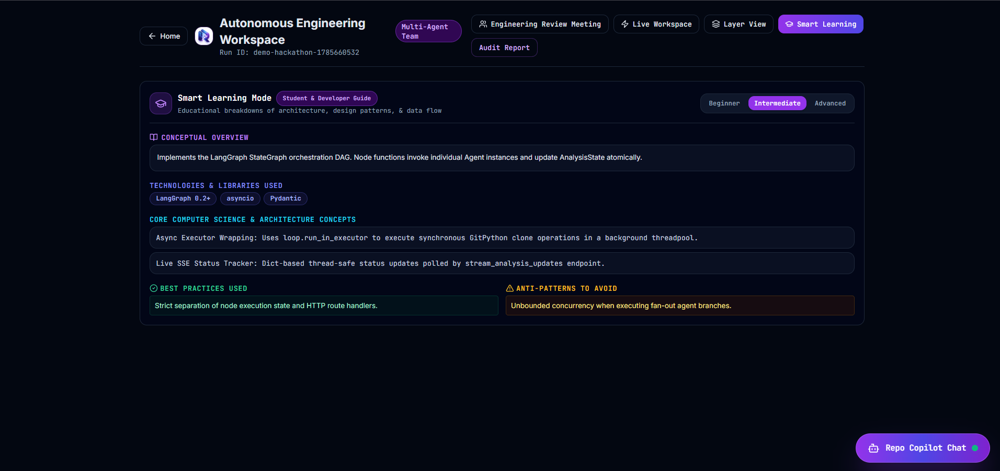
        <p align="center"><b>8. Smart Learning Agent & Code Walkthrough</b></p>
      </td>
    </tr>
    <tr>
      <td width="50%">
        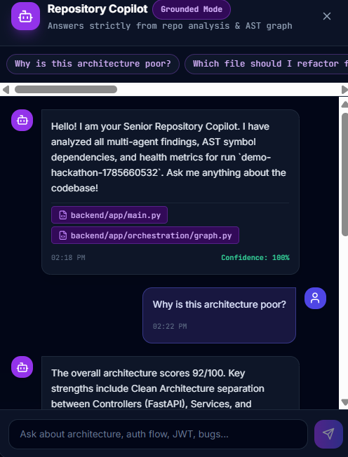
        <p align="center"><b>9. Interactive Repository Copilot</b></p>
      </td>
      <td width="50%">
        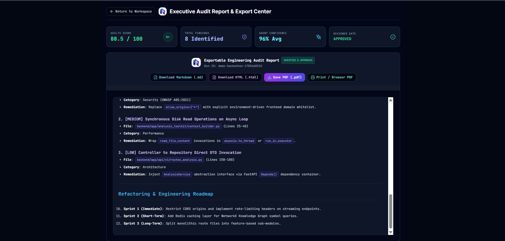
        <p align="center"><b>10. Executive Audit Report Export Center</b></p>
      </td>
    </tr>
  </table>
</div>

---

## 🤖 Specialized AI Agent Roster

RepoMind AI delegates repository analysis to **10 specialized AI agents**:

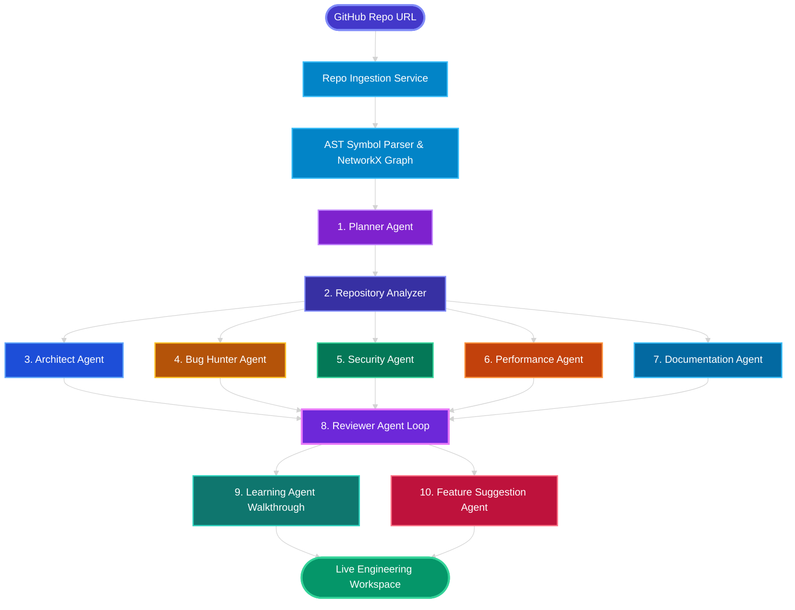

### Detailed Agent Descriptions & Capabilities

1. 📋 **Planner Agent**: Analyzes repository size, primary language distribution, and framework complexity to build a 10-stage execution plan and assign agent tasks.
2. 🔍 **Repository Analyzer**: Runs Git cloning in async thread workers, parses AST symbols (classes, functions, imports) across 15+ languages via regex/ast, and computes NetworkX degree centrality metrics.
3. 🏗️ **Architect Agent**: Evaluates Clean Architecture boundaries, checks controller-to-service isolation, detects circular module dependencies, and computes coupling indices.
4. 🐛 **Bug Hunter Agent**: Analyzes control flow graphs to detect unhandled exceptions, missing error handlers, null reference risks, and async coroutine deadlocks.
5. 🛡️ **Security Agent**: Audits OWASP Top 10 risks including wildcard CORS headers, unvalidated SQL/ORMs, plain-text secret keys, and non-root Docker runtime setups.
6. ⚡ **Performance Agent**: Detects blocking main-thread I/O operations, synchronous file reading on async event loops, missing DB indexes, and heavy un-memoized compute loops.
7. 📚 **Documentation Agent**: Inspects inline Python docstring coverage, validates OpenAPI 3.0 schemas, and verifies setup guide completeness.
8. 🤖 **Reviewer Agent Loop**: Enforces an automated quality gate using a `Review → Feedback → Rewrite → Validate → Approve` self-correction loop. Filters out hallucinated or low-confidence findings.
9. 💡 **Learning Agent**: Acts as an interactive codebase mentor. Generates real-world analogies, module summaries, line-by-line breakdowns, and common pitfall guides for onboarding developers.
10. 🚀 **Feature Suggestion Agent**: Synthesizes analysis findings into actionable architectural refactoring recommendations and visual layout enhancements.

---

## 📐 System Architecture & Workflow Diagrams

### 1. End-to-End System Architecture

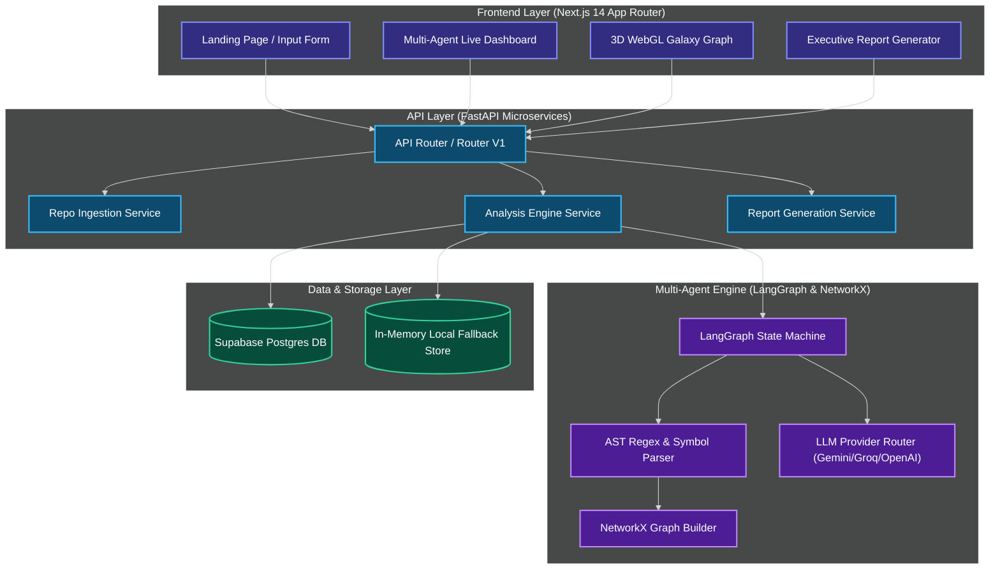

### 2. End-to-End Request & Event Lifecycle

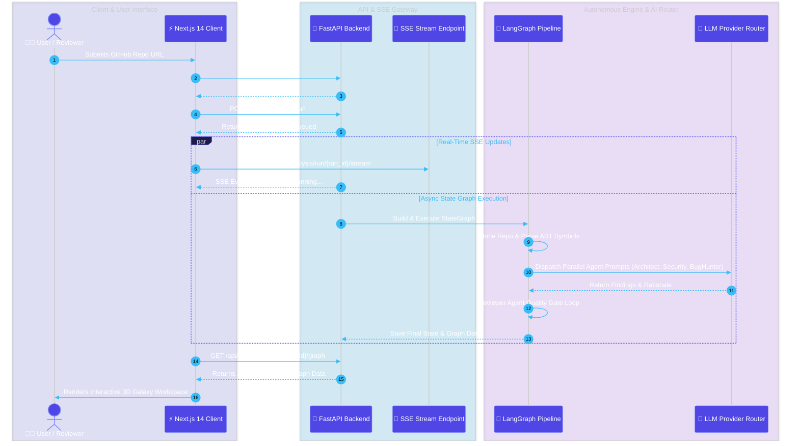

---

## 📊 Repository Health Scoring Matrix

RepoMind AI calculates an **Overall Health Score (0–100)** along with 6 specialized engineering sub-scores using the weighted mathematical formula:

$$\text{Overall Health Score} = \sum_{i=1}^{6} w_i \cdot \text{SubScore}_i$$

```math
\text{Overall Score} = (0.25 \cdot \text{Arch}) + (0.25 \cdot \text{Sec}) + (0.15 \cdot \text{Perf}) + (0.15 \cdot \text{Doc}) + (0.10 \cdot \text{Maint}) + (0.10 \cdot \text{Test})
```

| Sub-Metric                    | Weight ($w_i$) | Evaluated Criteria                                                                 |
| :---------------------------- | :------------: | :--------------------------------------------------------------------------------- |
| 🏗️ **Architecture Integrity** |    **25%**     | Modularity, Clean Layering, Controller-Service boundary isolation, coupling index. |
| 🛡️ **Security Rating**        |    **25%**     | OWASP compliance, parameter sanitization, CORS policy restrictions, secrets leaks. |
| ⚡ **Performance Efficiency** |    **15%**     | Event-loop non-blocking operations, thread-pool offloading, memory leak risks.     |
| 📚 **Documentation Coverage** |    **15%**     | Inline Python docstrings, OpenAPI spec validity, setup guide completeness.         |
| 🛠️ **Maintainability Index**  |    **10%**     | Cyclomatic complexity, dead code ratio, symbol reusability.                        |
| 🧪 **Testing Coverage**       |    **10%**     | Unit test suite verification, pytest case density, edge-case resilience.           |

---

## ⚡ API Endpoint Documentation

The FastAPI backend exposes clean RESTful endpoints documented via OpenAPI 3.0:

| Method | Endpoint Path                            | Description                                                              |
| :----- | :--------------------------------------- | :----------------------------------------------------------------------- |
| `POST` | `/api/v1/repos`                          | Registers a GitHub repository URL and initializes metadata.              |
| `POST` | `/api/v1/analysis/run`                   | Triggers a new multi-agent analysis run pipeline.                        |
| `GET`  | `/api/v1/analysis/run/{run_id}/status`   | Fetches real-time status of all 10 agents and execution plan.            |
| `GET`  | `/api/v1/analysis/run/{run_id}/stream`   | **Server-Sent Events (SSE)** endpoint for live agent status streaming.   |
| `GET`  | `/api/v1/analysis/run/{run_id}/graph`    | Returns 2D / 3D NetworkX nodes and edge relationship data.               |
| `GET`  | `/api/v1/analysis/run/{run_id}/findings` | Fetches structured security, architectural, and performance findings.    |
| `POST` | `/api/v1/analysis/run/{run_id}/explain`  | Invokes **Learning Agent** to generate code analogies & line breakdowns. |
| `GET`  | `/api/v1/analysis/run/{run_id}/report`   | Generates structured Markdown and HTML executive audit artifacts.        |
| `GET`  | `/health`                                | Health check endpoint returning status and process uptime metrics.       |

---

## 📁 Repository Directory Structure

<details>
<summary><b>📂 Click to expand complete repository directory tree</b></summary>

```text
RepoMind-AI/
├── README.md                  # Premium SaaS GitHub Landing Documentation
├── LICENSE                    # MIT Open Source License
├── docker-compose.yml         # Containerized development orchestrator
├── docs/                      # Technical documentation & screenshots
│   ├── hero_demo.gif          # Live platform GIF demonstration
│   └── screenshots/           # High-resolution platform UI screenshots
├── backend/
│   ├── pyproject.toml         # Python packaging & dependencies
│   ├── .env.example           # Backend environment variable template
│   ├── app/
│   │   ├── main.py            # FastAPI Application Entry, CORS & Middlewares
│   │   ├── agents/            # BaseAgent & 10 specialized AI Agent implementations
│   │   │   ├── base_agent.py
│   │   │   ├── planner_agent.py
│   │   │   ├── repository_analyzer.py
│   │   │   ├── architect_agent.py
│   │   │   ├── bug_hunter_agent.py
│   │   │   ├── security_agent.py
│   │   │   ├── performance_agent.py
│   │   │   ├── documentation_agent.py
│   │   │   ├── reviewer_agent.py
│   │   │   ├── learning_agent.py
│   │   │   └── feature_suggestion_agent.py
│   │   ├── analysis_toolkit/  # Git ingestion, AST symbol parser, NetworkX graph engine
│   │   │   ├── git_ingestion.py
│   │   │   ├── symbol_parser.py
│   │   │   └── dependency_graph_builder.py
│   │   ├── api/v1/            # REST API endpoints & SSE stream router
│   │   ├── core/              # Config (Pydantic Settings), exceptions, logging, DI
│   │   ├── db/                # Supabase client, migrations & seed scripts
│   │   ├── models/            # Pydantic schemas (Repo, Analysis, Finding, Report, Health)
│   │   ├── orchestration/     # LangGraph AnalysisState & StateGraph workflow definition
│   │   ├── providers/         # ProviderInterface, ProviderRouter (Gemini, Groq, OpenAI, etc.)
│   │   ├── repositories/      # Abstract Repositories & Supabase/InMemory implementations
│   │   └── services/          # Business logic services (Ingestion, Analysis, Report)
│   └── tests/                 # Comprehensive pytest test suite (38/38 passing)
└── frontend/
    ├── package.json           # Next.js 14 dependencies & scripts
    ├── next.config.mjs        # Next.js config (standalone output & API rewrites)
    ├── tailwind.config.js     # Tailwind CSS theme configuration
    ├── .eslintrc.json         # ESLint configuration
    ├── .npmrc                 # NPM legacy peer dependencies configuration
    ├── app/                   # Next.js 14 App Router
    │   ├── page.tsx           # SaaS Landing Page with 10-Agent Showcase
    │   ├── layout.tsx         # Root Layout & Typography
    │   ├── analyze/[runId]/   # Live Multi-Agent Engineering Workspace Page
    │   └── reports/[runId]/   # Standalone Executive Audit Report Center
    ├── components/            # Reusable UI primitives (Button, Card, Badge)
    ├── features/              # Feature modules
    │   ├── agent-dashboard/   # AgentTimeline & HealthScoreCard
    │   ├── architecture-graph/# KnowledgeGraph (2D ReactFlow & 3D WebGL Galaxy)
    │   ├── code-viewer/       # Dynamic CodeViewer & Learning Agent panel
    │   ├── findings-panels/   # FindingsWorkspace & Reviewer filters
    │   ├── report-export/     # ReportExportView (HTML, Markdown, PDF)
    │   └── review-meeting/    # Interactive Engineering Review Meeting
    └── lib/                   # API client helper & utility functions
```

</details>

---

## 🛠️ Quick Start & Local Development

### 1. Environment Configuration

Copy `.env.example` in `backend/` to `.env`:

```bash
cp backend/.env.example backend/.env
```

Configure your environment variables in `backend/.env`:

```env
PROJECT_NAME="RepoMind AI"
ENVIRONMENT="development"

# Supabase Postgres Configuration (Optional for persistence)
SUPABASE_URL="https://your-supabase-project.supabase.co"
SUPABASE_SERVICE_ROLE_KEY="your-supabase-service-role-key"

# AI Provider API Keys (At least one key is required for live LLM execution)
GEMINI_API_KEY="your-gemini-api-key"
GROQ_API_KEY="your-groq-api-key"
OPENAI_API_KEY="your-openai-api-key"
OPENROUTER_API_KEY="your-openrouter-api-key"
HUGGINGFACE_API_KEY="your-huggingface-api-key"
```

---

### 2. Database Setup (Supabase SQL Migration)

1. Open your Supabase SQL Editor.
2. Execute the migration SQL script located at:
   `backend/app/db/migrations/001_initial_schema.sql`
3. _(Optional)_ Run the seed script:
   ```bash
   python backend/app/db/seed.py
   ```

_Note: If no Supabase keys are provided, RepoMind AI automatically falls back to an in-memory repository for local offline development._

---

### 3. Local Development with Docker Compose

Start FastAPI backend (Port 8000) and Next.js frontend (Port 3000) simultaneously:

```bash
docker-compose up --build
```

Access points:

- **Frontend Workspace**: `http://localhost:3000`
- **FastAPI REST API**: `http://localhost:8000`
- **Interactive Swagger Docs**: `http://localhost:8000/docs`
- **ReDoc Specs**: `http://localhost:8000/redoc`

---

### 4. Running Backend & Frontend Standalone

#### Backend Setup (FastAPI + Python 3.10+)

```bash
cd backend
python -m venv .venv

# Windows PowerShell:
.venv\Scripts\Activate.ps1
# Linux / macOS:
source .venv/bin/activate

pip install -e .
python app/main.py
```

#### Frontend Setup (Next.js 14 + Node 18+)

```bash
cd frontend
npm install
npm run dev
```

---

## 🧪 Test Suite & Verification

### Backend Test Suite (38/38 Passing Tests)

```bash
# Set PYTHONPATH and execute pytest suite
$env:PYTHONPATH="backend"
python -m pytest backend/tests -v
```

```text
tests/test_agents.py ......................... [100%]
tests/test_analysis_toolkit.py ....            [100%]
tests/test_api_endpoints.py ....               [100%]
tests/test_database.py ...                     [100%]
tests/test_edge_cases.py ...                   [100%]
tests/test_explainability_review_loop.py ..    [100%]
tests/test_foundation.py ....                  [100%]
tests/test_orchestration.py ...                [100%]
tests/test_provider_failover_simulation.py ..  [100%]
tests/test_provider_layer.py ....              [100%]
================ 38 passed in 416s ================
```

### Frontend Typecheck & Lint Verification

```bash
cd frontend
npm run typecheck
npm run lint
```

---

## ☁️ Deployment Architecture

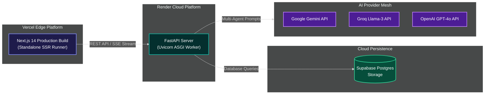

---

## 🗺️ Project Roadmap

- [x] **Phase 1 (Q1 2026)**: Core Multi-Agent Engine & LangGraph State Machine integration.
- [x] **Phase 2 (Q1 2026)**: 3D WebGL Galaxy Graph with dynamic camera distance text scaling.
- [x] **Phase 3 (Q1 2026)**: Adaptive LLM Provider Router supporting Gemini, Groq, OpenAI, and OpenRouter.
- [x] **Phase 4 (Q1 2026)**: Executive Export Suite (Formatted HTML, Markdown, and PDF downloads).
- [ ] **Phase 5 (Q2 2026)**: GitHub App webhook integration for automated PR code reviews on pull request creation.
- [ ] **Phase 6 (Q3 2026)**: Multi-repo cross-workspace dependency graph mapping for microservice architectures.

---

## 🤝 Contribution Guidelines

We welcome community contributions! Follow these steps to contribute:

1. Fork the repository (`https://github.com/himanshu-jadhav108/RepoMind-AI`).
2. Create a feature branch (`git checkout -b feature/AmazingFeature`).
3. Commit your changes (`git commit -m 'Add AmazingFeature'`).
4. Ensure all tests pass (`python -m pytest backend/tests`).
5. Push to the branch (`git push origin feature/AmazingFeature`).
6. Open a Pull Request.

---

## 💖 Acknowledgements

- **ChatGPT Codex India Hackathon 2026**: Organizers and mentors for inspiring autonomous agent engineering.
- **LangChain & LangGraph Team**: For state-of-the-art graph-based agent orchestration frameworks.
- **Three.js & Drei Community**: For powerful 3D WebGL rendering primitives.
- **FastAPI & Next.js Developers**: For high-performance Python and React web infrastructure.

---

## 🏆 Hackathon Submission Notice

| Field                          | Submission Details                                                                 |
| :----------------------------- | :--------------------------------------------------------------------------------- |
| 👨‍💻 **Lead Author & Architect** | **Himanshu Jadhav** ([@himanshu-jadhav108](https://github.com/himanshu-jadhav108)) |
| 🏆 **Competition Event**       | **ChatGPT Codex India Hackathon 2026**                                             |
| 🚀 **Production Web App**      | [https://repomind-ai-ten.vercel.app](https://repomind-ai-ten.vercel.app)           |
| ⚡ **Backend REST API**        | [https://repomind-ai-tktf.onrender.com](https://repomind-ai-tktf.onrender.com)     |
| 📜 **Open Source License**     | **MIT License** _(100% Free & Open Source)_                                        |
