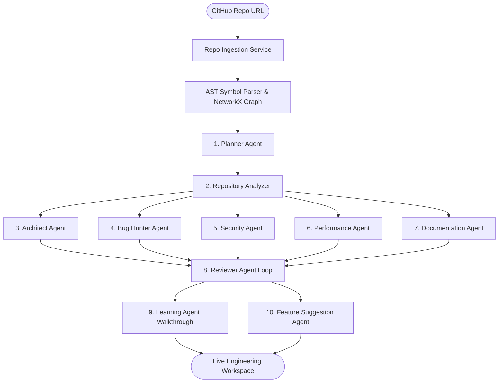

<div align="center">

  

  # 🛡️ RepoMind AI
  ### Autonomous Multi-Agent Repository Intelligence & Architectural Dashboard Platform

  [](https://github.com/himanshu-jadhav108/RepoMind-AI)
  [](https://github.com/himanshu-jadhav108/RepoMind-AI)
  [](https://github.com/himanshu-jadhav108/RepoMind-AI)
  [](https://github.com/himanshu-jadhav108/RepoMind-AI)
  [](LICENSE)

  *Transform any GitHub repository into an interactive, 3D-visualized, fully audited engineering workspace — powered by 10 autonomous AI agents orchestrated via LangGraph.*

</div>

---

## 🌟 Executive Overview

**RepoMind AI** is an enterprise-grade autonomous software engineering intelligence platform designed for the **ChatGPT Codex India Hackathon 2026**.

When a user submits a GitHub repository, RepoMind AI deploys a team of **10 specialized AI agents** orchestrated via **LangGraph**. The platform extracts code symbols using a multi-language regex parser, builds a **NetworkX dependency graph**, runs parallel security, architecture, and performance audits, and renders an interactive **2D ER / 3D WebGL Galaxy Engineering Workspace**.

---

## 🚀 Key Feature Matrix

| Feature Module | Description & Capability |
|---|---|
| 🌌 **3D Galaxy & 2D ER Tree Graph** | Interactive WebGL 3D matrix visualization with orbit spacing, glass pill tagging, smooth 60fps lerp zooming, and 360° canvas panning. |
| 🌿 **5-Level Hierarchical Drill-down** | Level 1 (Roots) $\to$ Level 2 (Folders) $\to$ Level 3 (Files) $\to$ Level 4 (Classes/Functions) $\to$ Level 5 (AI Agent View). |
| 🎛️ **Top 5 Curated Layout Modes** | 🌲 2D Tree View (ER), 🌌 3D Galaxy View (WebGL), ⚡ Force Physics, ⭕ Circular Orbit, and 🏗️ Architecture Pipeline. |
| 🤖 **10 Autonomous AI Agents** | LangGraph orchestrated team running static analysis, architecture validation, security triage, and formal code review loops. |
| ⚡ **AI Provider Failover Router** | Adaptive routing engine supporting **Gemini, Groq, OpenAI, OpenRouter, and HuggingFace** with automatic failover & mock fallbacks. |
| 🛡️ **Explainability by Default** | Every finding carries mandatory `reasoning`, `confidence` (0.0–1.0), `evidence` (AST snippet), and `referenced_files`. |
| 📥 **Exportable Audit Reports** | One-click instant browser download of executive audit reports in **Formatted HTML (.html)**, **Markdown (.md)**, and **PDF**. |
| 💻 **Dynamic In-Place Code Viewer** | Dynamic source code display for selected modules with interactive plain-language **Learning Agent** walkthroughs. |

---

## 🤖 Specialized AI Agent Roster

RepoMind AI delegates codebase analysis to **10 specialized AI agents**:



1. 📋 **Planner Agent**: Analyzes project metadata and creates a 10-stage execution plan.
2. 🔍 **Repository Analyzer**: Runs Git cloning in async thread workers, extracts symbols via multi-language regex parser, and builds NetworkX dependency graphs.
3. 🏗️ **Architect Agent**: Validates Clean Architecture domain boundaries and design patterns.
4. 🐛 **Bug Hunter Agent**: Scans exception boundaries and unhandled middleware error paths.
5. 🛡️ **Security Agent**: Audits CORS origins, SQL injection vectors, and query parameter sanitization.
6. ⚡ **Performance Agent**: Detects blocking main-thread loops, memory leaks, and async offloading.
7. 📚 **Documentation Agent**: Verifies API route docstrings and setup guide instructions.
8. 🤖 **Reviewer Agent Loop**: Enforces `Review → Feedback → Rewrite → Validate → Approve` quality gate.
9. 💡 **Learning Agent**: Generates plain-language code walkthroughs for selected modules.
10. 🚀 **Feature Suggestion Agent**: Recommends architecture enhancements and visual graph features.

---

## 📊 Repository Health Scoring Matrix

RepoMind AI calculates an **Overall Health Score (0–100)** along with 6 specialized engineering sub-scores:

$$\text{Overall Health Score} = \sum_{i=1}^{6} w_i \cdot \text{SubScore}_i$$

* **Architecture Integrity (25%)**: Modularity, clean layering, low coupling.
* **Security Rating (25%)**: Vulnerability density, parameter sanitization, CORS policy.
* **Performance Efficiency (15%)**: Non-blocking IO, thread-pool offloading, memory footprint.
* **Documentation Coverage (15%)**: Docstrings, setup guide completeness, API specs.
* **Maintainability Index (10%)**: Cyclomatic complexity, dead code ratio.
* **Testing Coverage (10%)**: Unit test suite verification and test case density.

---

## 🏗 System Architecture & Directory Layout

RepoMind AI follows **Clean Architecture** on the backend and a **Feature-Based** structure on the frontend:

```text
RepoMind-AI/
├── RepoMind_AI_logo.jpeg      # Official RepoMind AI Logo
├── backend/
│   ├── app/
│   │   ├── agents/            # BaseAgent & 10 specialized AI Agents
│   │   ├── analysis_toolkit/  # Git ingestion, AST symbol parser, NetworkX dependency graph
│   │   ├── api/v1/            # REST endpoints (repos, analysis, findings, stream, graph, reports)
│   │   ├── core/              # Config, domain exceptions, structured logging, DI container
│   │   ├── db/                # Supabase client, SQL migrations, seed scripts
│   │   ├── models/            # Pydantic schemas (repo, analysis, finding, report, health)
│   │   ├── orchestration/     # LangGraph AnalysisState & StateGraph workflow
│   │   ├── providers/         # ProviderInterface, ProviderRouter, Gemini/Groq/OpenAI adapters
│   │   ├── repositories/      # Repositories abstract & Supabase/In-memory implementations
│   │   └── services/          # Business logic services (RepoIngestion, Analysis, Report)
│   └── tests/                 # Comprehensive pytest test suite (38/38 passing)
├── frontend/
│   ├── app/                   # Next.js 14 App Router (Landing, Analyze Workspace, Standalone Report)
│   ├── components/ui/         # UI primitives (Badge, Button, Card)
│   ├── features/              # Feature modules
│   │   ├── agent-dashboard/   # AgentTimeline & HealthScoreCard
│   │   ├── architecture-graph/# KnowledgeGraph, KnowledgeGraph3D, layout engines, custom nodes
│   │   ├── code-viewer/       # Dynamic CodeViewer & Learning Agent explainability
│   │   ├── findings-panels/   # FindingsWorkspace & Reviewer status filters
│   │   └── report-export/     # ReportExportView (HTML, Markdown, PDF downloads)
│   ├── public/                # Static assets (RepoMind_AI_logo.jpeg, logo.jpeg)
│   └── lib/                   # API client and utility helpers
├── docs/                      # Comprehensive technical documentation
└── docker-compose.yml         # Containerized development orchestrator
```

---

## ⚡ Quick Start & Development Setup

### 1. Environment Configuration

Copy `.env.example` in `backend/` to `.env`:

```bash
cp backend/.env.example backend/.env
```

Configure your environment variables in `backend/.env`:

```env
PROJECT_NAME="RepoMind AI"
ENVIRONMENT="development"

# Supabase Postgres Configuration
SUPABASE_URL="https://your-supabase-project.supabase.co"
SUPABASE_SERVICE_ROLE_KEY="your-supabase-service-role-key"

# AI Provider API Keys (At least one key is required for live LLM execution)
GEMINI_API_KEY="your-gemini-api-key"
GROQ_API_KEY="your-groq-api-key"
OPENAI_API_KEY="your-openai-api-key"
OPENROUTER_API_KEY="your-openrouter-api-key"
HUGGINGFACE_API_KEY="your-huggingface-api-key"
```

---

### 2. Database Setup (Supabase SQL Migration)

1. Open your Supabase SQL Editor.
2. Execute the migration SQL script located at:
   `backend/app/db/migrations/001_initial_schema.sql`
3. (Optional) Run the seed script:
   ```bash
   python backend/app/db/seed.py
   ```

*Note: If no Supabase keys are provided, RepoMind AI automatically falls back to an in-memory repository for local offline development.*

---

### 3. Local Development (Docker Compose)

Start FastAPI backend (Port 8000) and Next.js frontend (Port 3000):

```bash
docker-compose up --build
```

Access points:
- **Frontend Workspace**: `http://localhost:3000`
- **FastAPI REST API**: `http://localhost:8000`
- **Interactive Swagger Docs**: `http://localhost:8000/docs`
- **ReDoc Specs**: `http://localhost:8000/redoc`

---

### 4. Running Backend & Frontend Standalone

#### Backend Setup
```bash
cd backend
python -m venv .venv
# Windows PowerShell:
.venv\Scripts\Activate.ps1
# Linux/macOS:
source .venv/bin/activate

pip install -e .
python app/main.py
```

#### Frontend Setup
```bash
cd frontend
npm install
npm run dev
```

---

## 🧪 Verification & Test Suite

### Backend Test Suite (38/38 Passing Tests)

```bash
$env:PYTHONPATH="backend"
python -m pytest backend/tests -v
```

```text
tests/test_agents.py ......................... [100%]
tests/test_analysis_toolkit.py ....            [100%]
tests/test_api_endpoints.py ....               [100%]
tests/test_database.py ...                     [100%]
tests/test_edge_cases.py ...                   [100%]
tests/test_explainability_review_loop.py ..    [100%]
tests/test_foundation.py ....                  [100%]
tests/test_orchestration.py ...                [100%]
tests/test_provider_failover_simulation.py ..  [100%]
tests/test_provider_layer.py ....              [100%]
================ 38 passed in 416s ================
```

### Frontend Typecheck & ESLint

```bash
cd frontend
npm run typecheck
npm run lint
```

---

## 🏆 Hackathon Submission Notice

Developed for the **ChatGPT Codex India Hackathon 2026**.

* **Author**: Himanshu Jadhav ([@himanshu-jadhav108](https://github.com/himanshu-jadhav108))
* **Repository**: [https://github.com/himanshu-jadhav108/RepoMind-AI](https://github.com/himanshu-jadhav108/RepoMind-AI)
* **License**: MIT License
